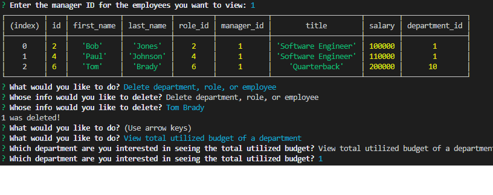

# employee-tracker

## Description 

This project is a command line interface that allows a user to add, view, and update various employees in a MySQL database. This project utilized CRUD (create, read, update, delete) MySQL queries through Node.js.

This project practice combining tables in a common database that can be applied to various database queries.

Use this code as a template for MySQL database queries, connecting MySQL to Node.js, or use this project to learn how to use the NPM package "Inquirer".

## Table of Contents 

* [Installation](#installation)
* [Usage](#usage)
* [Credits](#credits)
* [License](#license)

## Installation

To install the project files, you can clone the "employee-tracker" repository which contains the necessary files at https://github.com/jgarcia60/employee-tracker by clicking the green drop down "Code" and cloning the repo with an SSH key. To run the command line interface app, you will need to run "node server.js" in the correct directory in your terminal. However, the "schema.sql" file should be run in your MySQL GUI first to create the database before connecting it in Node.js.

## Usage 

You may use this code to learn about using the Inquirer npm package to create a command line interface application, or as a tool to learn about using node.js, utilizing "CRUD" queries in MySQL, and more! Check out the video below on how this application works: 

https://drive.google.com/file/d/18kHBLR7XUtoHKWpt_7HMxDP3UFUKhbRC/view

This is what it looks like:

## Credits

All code for this project was developed by Jonathan Garcia (https://github.com/jgarcia60/). 

## License

MIT License

Copyright (c) [2020] [Jonathan Garcia]

Permission is hereby granted, free of charge, to any person obtaining a copy
of this software and associated documentation files (the "Software"), to deal
in the Software without restriction, including without limitation the rights
to use, copy, modify, merge, publish, distribute, sublicense, and/or sell
copies of the Software, and to permit persons to whom the Software is
furnished to do so, subject to the following conditions:
The above copyright notice and this permission notice shall be included in all
copies or substantial portions of the Software.

THE SOFTWARE IS PROVIDED "AS IS", WITHOUT WARRANTY OF ANY KIND, EXPRESS OR
IMPLIED, INCLUDING BUT NOT LIMITED TO THE WARRANTIES OF MERCHANTABILITY,
FITNESS FOR A PARTICULAR PURPOSE AND NONINFRINGEMENT. IN NO EVENT SHALL THE
AUTHORS OR COPYRIGHT HOLDERS BE LIABLE FOR ANY CLAIM, DAMAGES OR OTHER
LIABILITY, WHETHER IN AN ACTION OF CONTRACT, TORT OR OTHERWISE, ARISING FROM,
OUT OF OR IN CONNECTION WITH THE SOFTWARE OR THE USE OR OTHER DEALINGS IN THE
SOFTWARE.

---